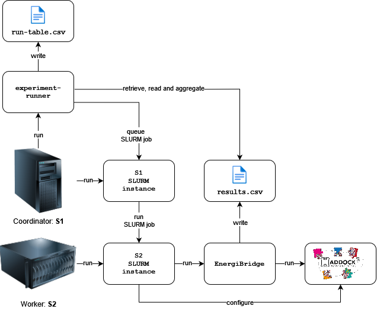

# Green Lab 2024 replication package

This is the replication package for the project submission of team *name of the team* for the 2024 edition of the Green Lab course. Our goal is identify The performance and energy efficiency impact of parallelising
the execution of jobs in High Performance Computing (HPC) domain. In particular, using SLURM, we run a number of [haddock3](https://github.com/haddocking/haddock3) jobs using different splits of core counts per group of jobs and measure the energy and energy usage, the CPU utilisation and the execution time, to identify how different paralellisation splits affect these metrics. 

## Architecture

The architecture of the framework is illustrated in the below diagram:



## Requirements

The framework has been tested with Python3 version 3.8, but should also work with any higher version. It has been tested under Linux and macOS. It does **not** work on Windows (at the moment).

The experiment requires two servers: one for dispatching jobs using SLURM (`S1`) and one purely dedicated to executing these jobs (the HPC instance, `S2`). SLURM must be setup on these servers such that jobs can be queued by `S1` to be executed on `S2`.

## Setup

### 1. Coordinator Node (`S1`) 

#### 1.1 Clone this repo

```sh
git clone git@github.com:andrulonis/Green-Lab.git
cd Green-Lab
```
#### 1.2 Dependencies

Create and activate a virtual environment:

```sh
python -m venv .venv
. .venv/bin/activate
```
Install the requirements:

```sh
pip install -r requirements.txt
```

#### 1.3 Shared directory

Set up a shared directory using the commands below. Replace `<hostname_of_S2>` with the hostname of the worker node (`S2`). This directory will be used to share the experiment configurations and the experiment results between the coordinator node and the worker node. Typically you can use the name of the SLURM node as the hostname.

```sh
mkdir configs/haddock/shared
echo "${PWD}/configs/haddock/shared <hostname_of_S2>(rw,sync,no_subtree_check,anonuid=1006,anongid=1006)" | sudo tee -a /etc/exports
sudo exportfs -ra
```

### 2. Worker Node (`S2`)

#### 2.1 HADDOCK3

Install **haddock3** by following the HADDOCK3 install instructions:
https://github.com/haddocking/haddock3/blob/main/docs/INSTALL.md.

#### 2.2 Shared directory

Mount the shared directory that you created on `S1` somehwere on `S2`. An example configuration is given below. Replace `<hostname_of_S1>` with the hostname of the coordinator node (`S1`) and ensure that the paths are valid.

```sh
mkdir ~/shared
sudo mount -o rw <hostname_of_S1>:/path/to/configs/haddock/shared ~/shared
```

Test if you are able to write a file to this shared directory:

```sh
touch ~/shared/test
```

Read it on `S1` to confirm that the NFS write worked.

#### 2.3 EnergiBridge

Make sure [EnergiBridge](https://github.com/tdurieux/EnergiBridge) is installed on `S2` and added to PATH. Follow the instructions on the README of the EnergiBridge repository.

### 3. Permissions

Energibridge must be configured to be executable by the current user _without root_, i.e. follow the instructions on the energibridge repo to setup the `msr` group. This part is a bit tricky, since SLURM listens to the group IDS set on the user that is enqueueing SLURM jobs, in our case the user running experiment runner on `S1`. Therefore, to execute energibridge without root, we must add the user on `S1` to a group `msr`, that **has the same group ID** as the one on `S2`. 

After following the README instructions for EnergiBridge:
1. On `S1`, create group `msr`:

    ```sh
    sudo groupadd msr
    ```

2. On `S1` and `S2`, get the GID of group `msr`:

    ```sh
    getent group msr | cut -d: -f3
    ```

3. If the group IDs are equal, you are done. If not, we must update `S1`'s `msr` GID to be the same as the one on `S2`. Replace `<MSR_GID_S2>` with the GID of the `msr` group on `S2`, and execute the command on `S1`.

    ```sh
    groupmod -g <NEW_GID> msr
    newgrp msr
    ```

## Running

In this section we assume as the current working directory the root directory of the project and that the virtual environment is activated, if you made one.

#### 1. Set up environment variables
Create a copy of the `.env.template` file and name it `.env`. Fill in the necessary environment variables as described in the file.

#### 2. Run the config

```sh
python experiment-runner/ configs/haddock/RunnerConfig.py
```

The results of the experiment will be stored in the directory `configs/haddock/experiments`.

Note that once you successfully run an experiment, the framework will not allow you to run the same experiment again. Remove the `experiments` directory under `configs/haddock/experiments` if you are sure you want to restart the experiment.

