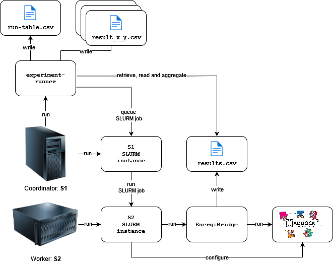

# Green Lab 2024 replication package

This is the replication package for the project submission of team *name of the team* for the 2024 edition of the Green Lab course. Our goal is identify The performance and energy efficiency impact of parallelising
the execution of jobs in High Performance Computing (HPC) domain. In particular, using SLURM, we run a number of [haddock3](https://github.com/haddocking/haddock3) jobs using different splits of core counts per group of jobs and measure the energy and energy usage, the CPU utilisation and the execution time, to identify how different paralellisation splits affect these metrics. 

## Architecture

The architecture of the framework is illustrated in the below diagram:



## Requirements

The framework has been tested with Python3 version 3.8, but should also work with any higher version. It has been tested under Linux and macOS. It does **not** work on Windows (at the moment).

The experiment requires two servers: one for dispatching jobs using SLURM (`S1`) and one purely dedicated to executing these jobs (the HPC instance, `S2`). SLURM must be setup on these servers such that jobs can be queued by `S1` to be executed on `S2`.

## Setup

### 1. Coordinator Node (`S1`) 

#### 1.1 Clone this repo

```bash
git clone git@github.com:andrulonis/Green-Lab.git
cd Green-Lab
```
#### 1.2 Dependencies

Create and activate a virtual environment:

```bash
python -m venv .venv
. .venv/bin/activate
```
Install the requirements:

```bash
pip install -r requirements.txt
```

#### 1.3 Shared directory

Set up a shared directory using the commands below. Replace `<hostname_of_S2>` with the hostname of the worker node (`S2`). This directory will be used to share the experiment configurations and the experiment results between the coordinator node and the worker node. Typically you can use the name of the SLURM node as the hostname.

```bash
export WORKER_NODE=<hostname_of_S2>
mkdir configs/haddock/shared
echo "${PWD}/configs/haddock/shared ${WORKER_NODE}(rw,sync,no_subtree_check)" | sudo tee -a /etc/exports
sudo exportfs -ra
```

### 2. Worker Node (`S2`)
Install **haddock3** by following the HADDOCK3 install instructions:
https://github.com/haddocking/haddock3/blob/main/docs/INSTALL.md.

## Running

In this section we assume as the current working directory the root directory of the project.

#### 1. Set up environment variables
Create a copy of the `.env.template` file and name it `.env`. Fill in the necessary environment variables as described in the file.

#### 2. Run the config

```bash
python experiment-runner/ configs/haddock/RunnerConfig.py
```

The results of the experiment will be stored in the directory `configs/haddock/experiments`.

Note that once you successfully run an experiment, the framework will not allow you to run the same experiment again. Remove the `experiments` directory under `configs/haddock/experiments` if you are sure you want to restart the experiment.

